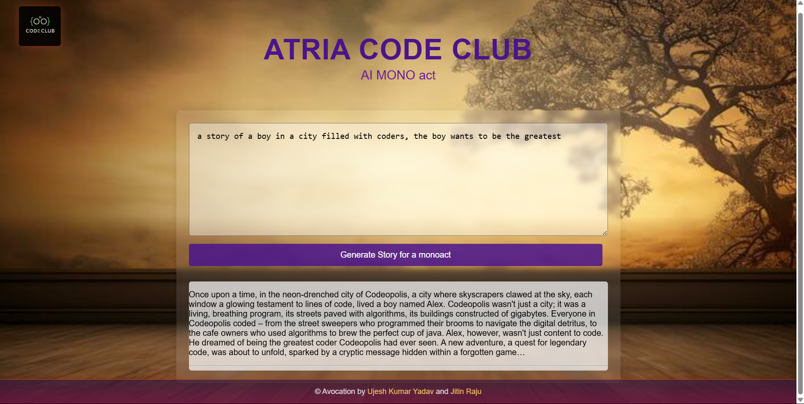

# **AI Story & Image Generator**

This project is a **web-based AI-powered Mono-Act Story and Image Generator** that allows users to create dramatic solo-act scripts based on a given prompt and genre selection. It utilizes **Google's Gemini AI** to generate engaging mono-act scripts and the **Unsplash API** to fetch relevant images for visualization.

## **🚀 Features**

- **Genre Selection** – Choose from multiple genres like Horror, Mystery, Romance, Sci-Fi, etc.
- **AI-Powered Story Generation** – Generates **mono-act scripts** based on the user's prompt.
- **Image Generation** – Fetches related images using the **Unsplash API**.
- **Interactive UI** – A clean, user-friendly interface with a responsive design.
- **Dynamic Content Display** – Stories and images appear in real time without page refresh.

## **🛠️ Technologies Used**

- **Frontend:** HTML, CSS, JavaScript
- **AI Integration:** Google Gemini AI
- **Image Fetching:** Unsplash API

## **📌 Installation & Setup**

1. Clone the repository:
   ```sh
   git clone https://github.com/UJESH2K/MONO_ACT-.git
   ```
2. Navigate to the project directory:
   ```sh
   cd ai-story-image-generator
   ```
3. Open `index.html` in your browser to run the application.

## **🔑 API Keys Required**

- **Google Gemini AI API Key** (For story generation)
- **Unsplash API Key** (For fetching images)

Add your API keys in the `index.js` file:

```js
const GEMINI_API_KEY = "your-gemini-api-key";
```

## **📸 Screenshots**




## **📜 License**

This project is open-source under the **MIT License**. Feel free to modify and enhance it!

---

This README is structured professionally and covers all the key details of your project. Let me know if you need any changes! 🚀
